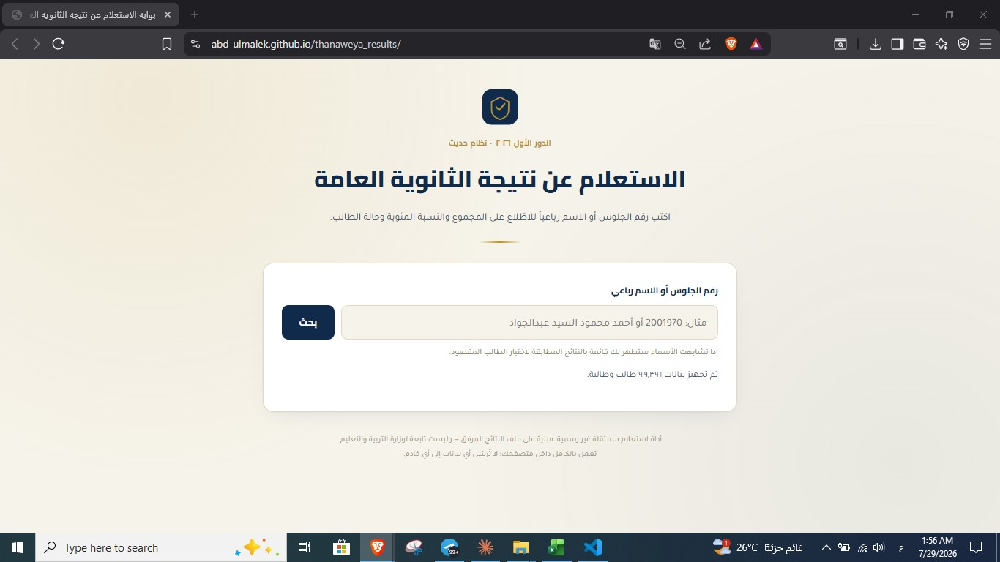

<div align="center">

# 🎓 Thanaweya Amma Results Portal

### 2026 First Round · Modern System (Egypt)

Instant result lookup by seating number or full name — runs entirely in the browser, no server, no internet required after the first load.

[](#)
[](#)
[](#)

</div>

---

## ✨ Features

| Feature | Description |
|---|---|
| 🔍 **Search by seating number** | Instant, exact match |
| 📝 **Search by full name** | Ignores diacritics and common Arabic letter variants (alef, ya, ta marbuta) |
| 👥 **Multiple matches** | If several students share a name, a picklist is shown so the user selects the right one |
| 📊 **Full details** | Total score, percentage, and student status |
| 🔒 **Full privacy** | All data and processing happen locally in the user's browser — nothing is ever sent to a server |
| ⚡ **No backend** | A single self-contained HTML file that runs on any static host |

> Note: the site's user interface is in Arabic, since it's built for Egyptian Thanaweya Amma students.

---

## 🖼️ Screenshot




---

## 🚀 Deploying on GitHub Pages

1. Open the **Settings** tab of the repo.
2. In the sidebar, select **Pages**.
3. Under **Branch**, choose `main` and the `/(root)` folder, then click **Save**.
4. After a minute or two, the live link will appear at the top of that same page, in the form:
   ```
   https://<username>.github.io/<repo-name>/
   ```


---

## 🧩 How it works

- The site is a **single self-contained HTML file** (no external files besides a Google Fonts stylesheet).
- The result data (~920,000 students) is gzip-compressed, Base64-encoded, and embedded directly inside the file.
- On page load, the browser decompresses and indexes the data locally (takes 3–5 seconds depending on device speed); after that, search is instant.
- There is no database, no API, and no internet connection required after the initial page load.

**Percentage** is calculated as:

```
percentage % = (total_degree ÷ 320) × 100
```

---

## 🛠️ Updating the data later

To update the results (a new round, a new year, etc.), send over the new Excel file and a refreshed version of this same file — same design, same features — can be generated automatically.

---

## ⚠️ Disclaimer

This is an **independent, unofficial** lookup tool built from provided data. It is not affiliated with the Egyptian Ministry of Education or any official government body. Always verify your official result through approved government channels.

---

## 📄 License

This project is free to use and modify for personal purposes.

</div>
